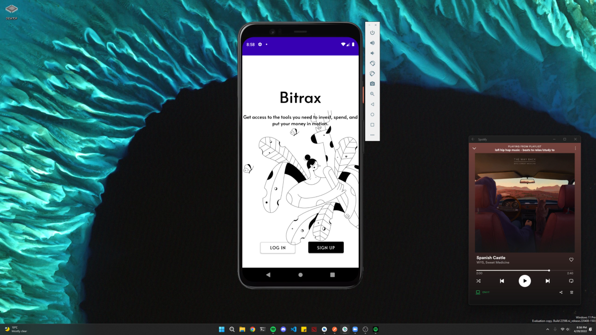
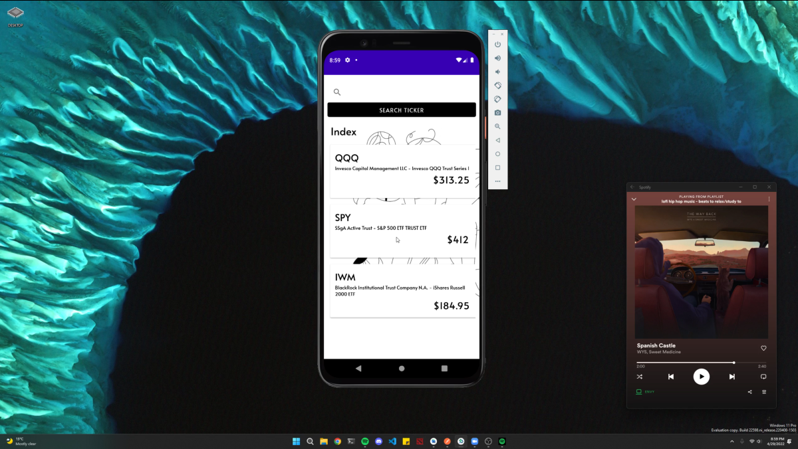
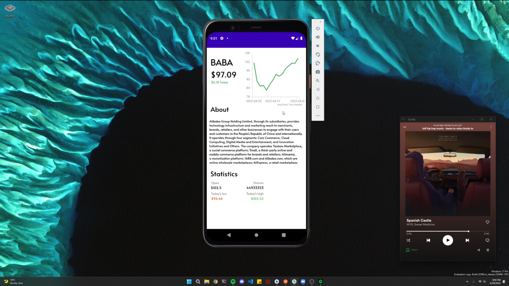

# Project Title: Bitrax - Personalized Stock & Crypto Watchlist App
# Project Description
Bitrax is a user-friendly mobile app designed to help investors stay up-to-date with real-time market data and easily manage their stock and cryptocurrency watchlists. The app integrates with Yahoo Finance API, Alpha Vantage API, and Firebase Auth to provide users with a seamless experience.

Upon launching the app, users can sign up or log in with their Firebase Auth credentials. Once logged in, they can start creating their personalized stock and crypto watchlists, by simply searching for tickers and adding them to their list. The app stores the watchlist in the user's Firebase database, making it easy to access from any device.

One of the key features of Bitrax is the ability to view market data in real-time. When a user searches for a ticker, the app uses the Alpha Vantage API to retrieve the latest market data, including price, price change, high, low, open price, closing price, and volume. Additionally, the app generates a graph of the stock prices, allowing users to visualize the performance of the stock over a specified period.

Other features of the Bitrax app include the ability to view news articles related to each stock or crypto, and the ability to set price alerts. Users can choose to receive alerts when a stock or crypto reaches a specific price point, making it easier to make informed trading decisions.

The Bitrax app is built using modern mobile development technologies, including Android Studio, Kotlin, and Firebase. The app leverages the Yahoo Finance API and Alpha Vantage API to retrieve real-time market data and news articles, respectively. Firebase Auth is used to securely manage user authentication, while Firebase Realtime Database is used to store and retrieve user watchlists.

# Features List:
- Login functionality using Firebase Auth - The app allows users to sign up and log in securely using Firebase authentication.
- Stock and Crypto Watchlist - Users can create a personalized watchlist of stocks and cryptocurrencies they are interested in tracking.
- Search Ticker - Users can search for a particular stock or cryptocurrency ticker to view its market data.
- Graphical Representations - The app uses Alpha Vantage API to provide users with a graphical representation of the stock prices, including other market data such as price, price change, high, low, open price, closing price, and volume.
- Real-Time Data - The app provides real-time data on market trends, allowing users to make informed investment decisions.
- Mobile-Friendly Design - The website portfolio has a mobile-friendly design, making it easily accessible on any device.

# Technologies Used:
- Android Studio: The official IDE for Android development.
- Kotlin: A modern programming language used for Android development.
- XML: The markup language used for designing the user interface.
- Firebase: Firebase is used to manage user authentication and store user data securely.

# APIs Used:
- Yahoo Finance API - The Yahoo Finance API is used to access financial data and provide real-time updates on market trends.
- Alpha Vantage API - Alpha Vantage API is used to generate graphical representations of market data and provide real-time updates on market trends.
- Firebase Authentication API - Firebase Authentication API is used to manage user authentication and store user data securely.

# Necessary Information:
- Contact Information - The website portfolio provides users with contact information for support and feedback.
- About Us - The website portfolio includes information about the app development team and their mission.
- Privacy Policy - The website portfolio includes a privacy policy, outlining the app's data collection and usage policies.
- Terms of Service - The website portfolio includes terms of service, outlining the app's rules and regulations.
- FAQ - The website portfolio includes an FAQ section, answering common questions about the app and its functionality.