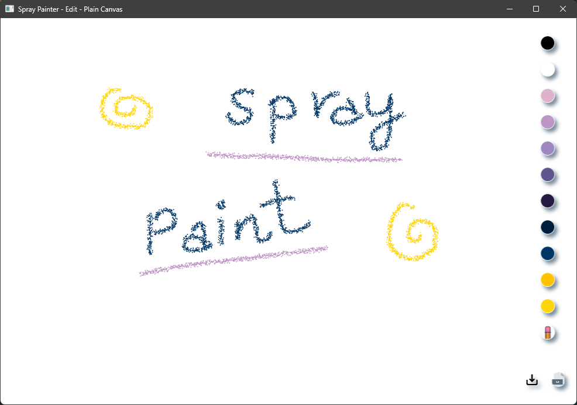
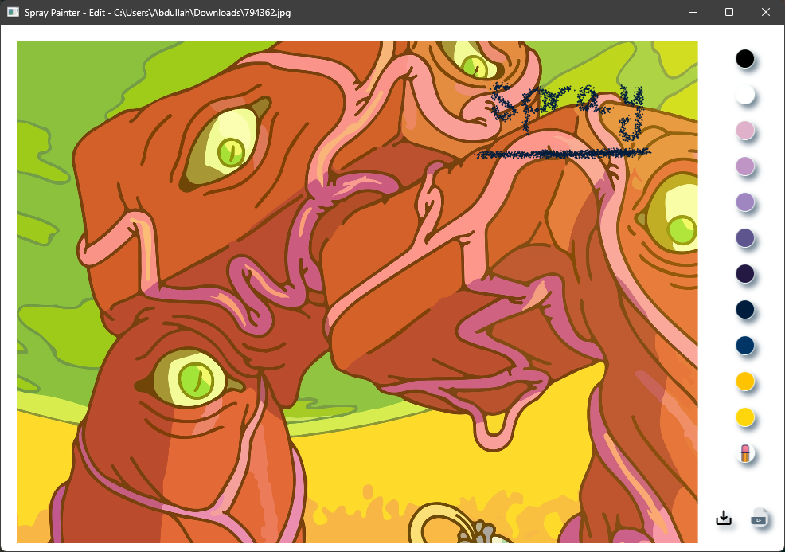

# Project Title: Paint Spray Program in .NET
# Project Description
The Paint Spray Program is a Windows application built in .NET that allows users to load images or create artwork on a blank canvas using spray paint. The application has a simple and intuitive user interface that includes a canvas area for drawing, a toolbar with various painting tools, and buttons for saving and loading drawings.



## SprayPaint.exe
```
/Release/SprayPaint.exe
```
# Features
- Users can choose to load an image from their computer or start with a blank canvas to create artwork from scratch.
- The application offers a variety of painting tools, including a spray paint tool, an eraser tool, and a color palette.
- The eraser button clears the entire canvas, allowing users to start fresh.
- The save button saves the current ink collection in an .icf file.
- The .icf button loads the saved ink collection onto the canvas for users to re-edit their work.
- /n



# Limitations

- The canvas cursor is set transparent, so it may not be visible to users.
- The window does not automatically scale or resize based on the loaded image because of the bitmap decoder required at runtime.
- The application does not offer a feature to erase the canvas stroke by stroke.

# Resources Used:
- The application was developed using Microsoft's .NET framework and several related resources, including:
> - Microsoft documentation on creating Windows applications using WPF and XAML.
> - Microsoft documentation on advanced features, including alignment, margins, padding, ink collection, and message boxes.

# Technologies Used
- XAML
- .NET Framework
- C#
- MVVM

